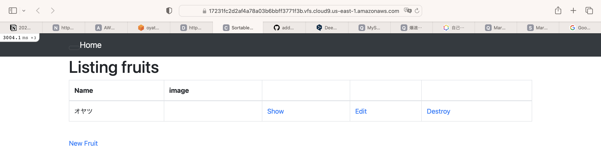

## 第３回課題報告書

#### サンプルアプリケーションのデプロイ

#### APサーバーについて
 プログラムで作られたアプリケーションを実行する為に必要なサーバー、「組み込み
 」と言われる内臓型アプリケーションサーバー、今回利用するRails もこれと同様の
 形式である。資料61〜62にて確認。

#### AP サーバーの名前とバージョンを確認してみましょう。
Puma version: 5.6.5 (ruby 3.1.2-p20)

#### AP サーバーを終了させた場合、引き続きアクセスできますか?結果を確認して、また AP サーバーを起動してください。
サーバーを終了（停止）した状態ではアクセス出来ませんでした。
大きくOPS!と表示されます。その後rails sでサーバー起動すれば
またアクセス出来た。

#### DBサーバーについて。サンプルアプリケーションで使った DB サーバー(DB エンジン)の名前と、今 Cloud9 で動作しているバージョンはいくつか確認してみましょう。
MySQL  Ver 8.0.34

#### DB サーバーを終了させた場合、引き続きアクセスできますか?
出来ません。赤いエラー画面がでる。

#### Railsの構成管理ツールの名前は何でしたか?
bundler です。講座資料59にて確認。

#### 今回の課題から学んだことを報告してください。
別ファイルに記述済です。