# 第5回課題報告

### サンプルアプリケーションをEC2上にデプロイして動作させる、サーバーアプリケーションを分ける

- 組み込みサーバーだけで表示

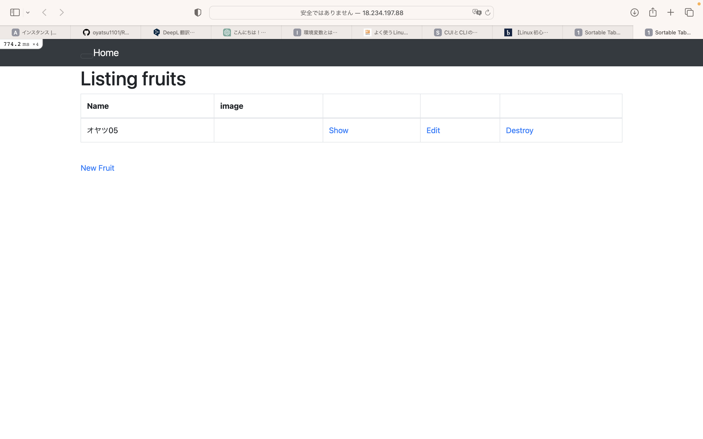

- サーバーアプリケーションを分けて表示

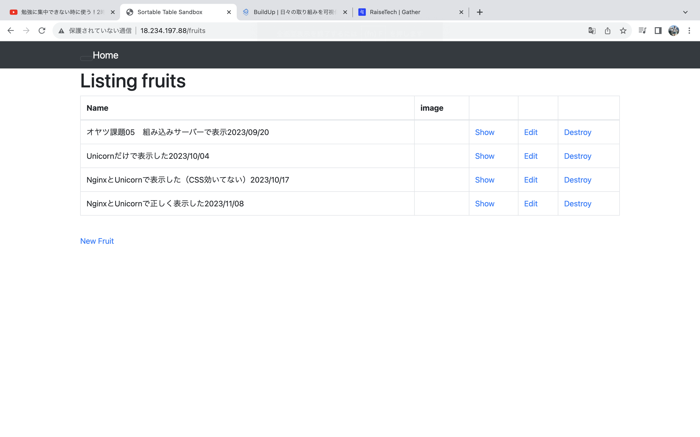

### ALBを追加、動作確認

- ALB詳細

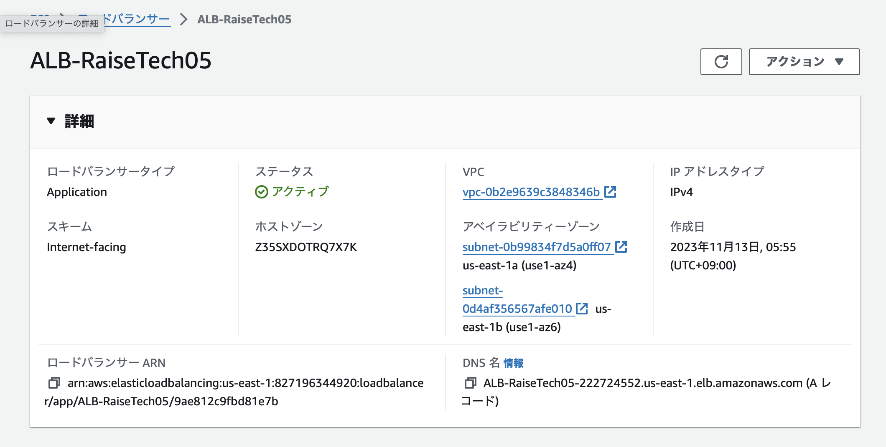

- ターゲットグループ詳細

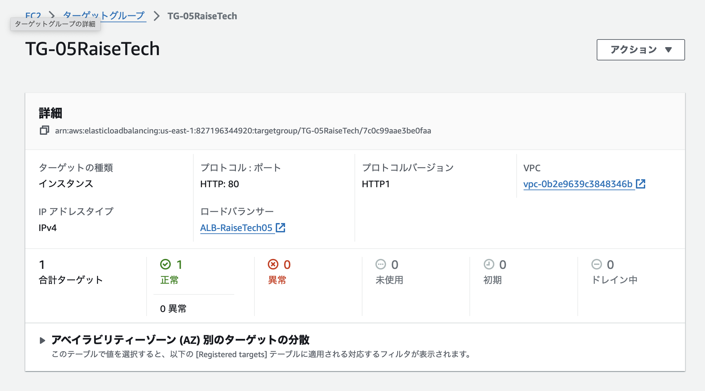

- 登録済みターゲット

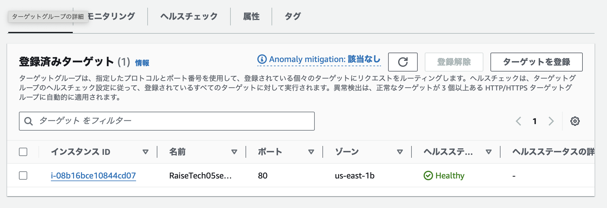

- 動作確認

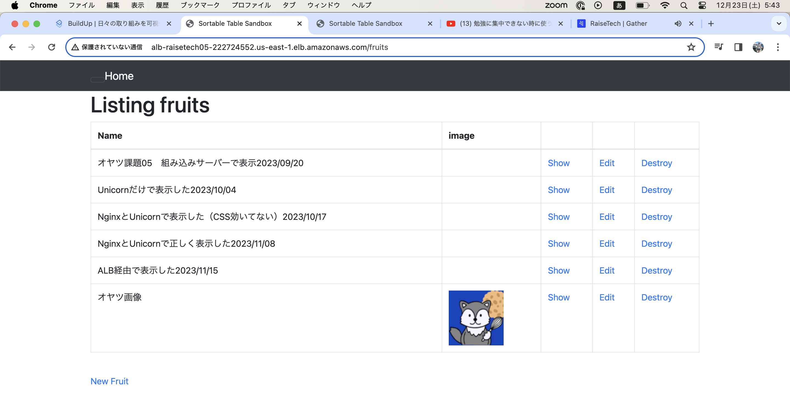

### S3を追加、動作確認

- s3fs-fuseを使用し、S3バケットを直接マウントしました。画像の保存先をS3に変更しました。

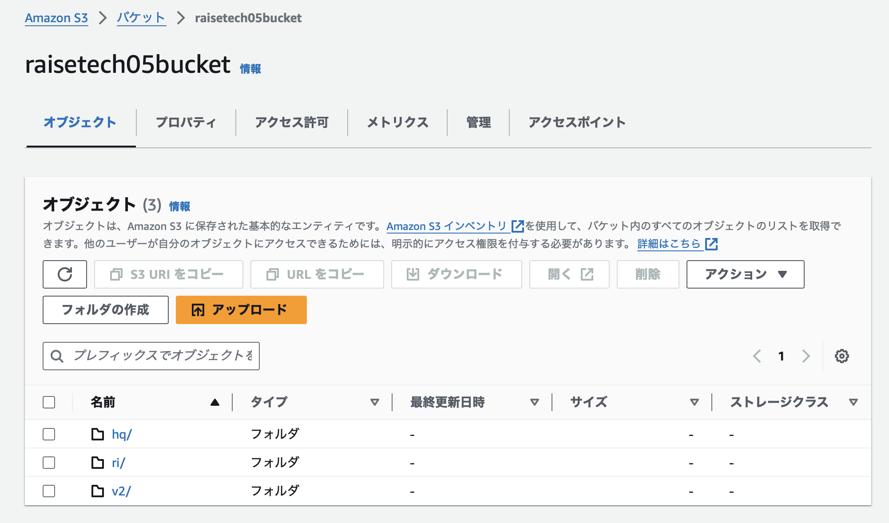

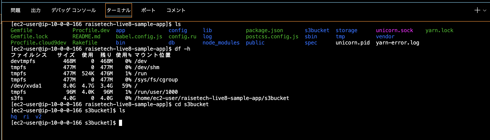

- 保存した画像

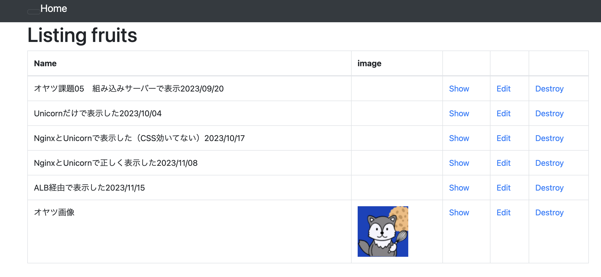

### 構成図

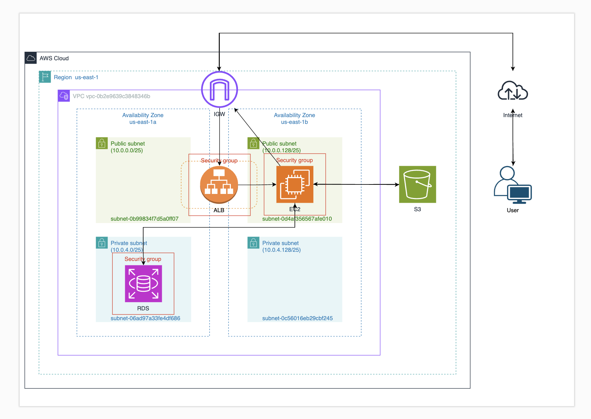

### インフラストラクチャー構成とセキュリティ概要

- VPC詳細

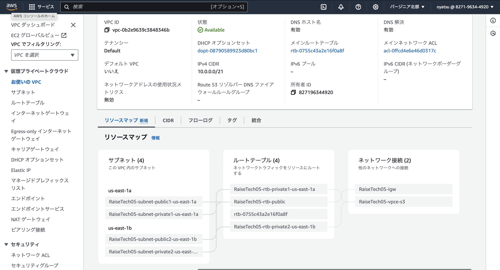

- EC2詳細

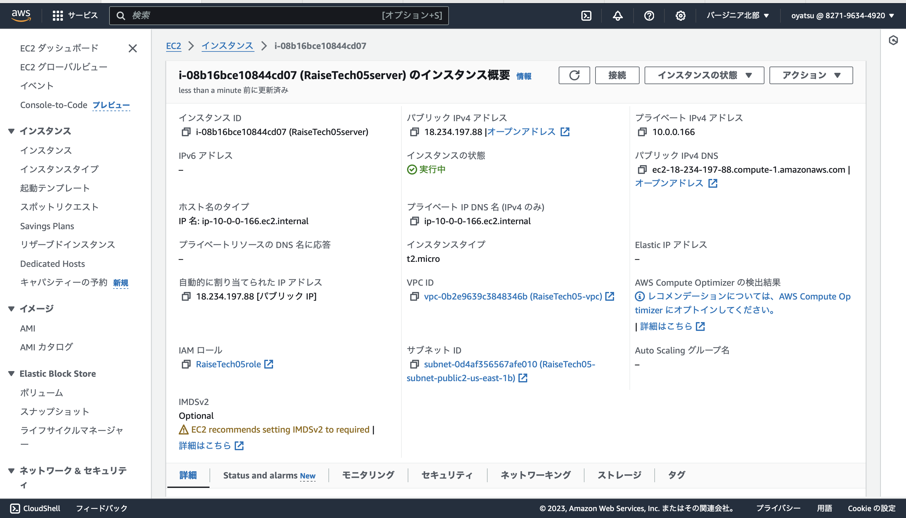

- RDS詳細、接続とセキュリティ

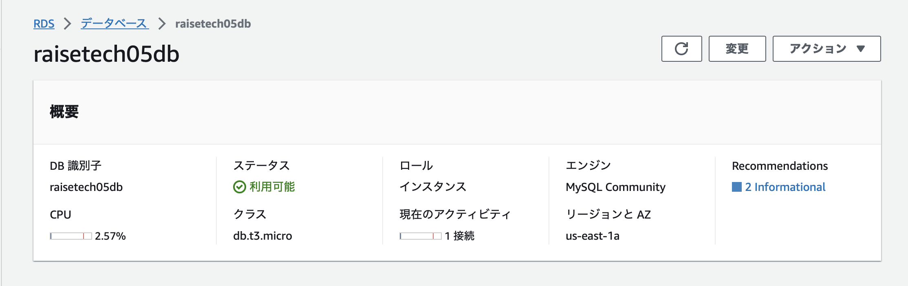

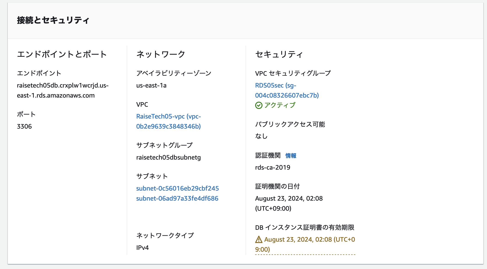

- セキュリティーグループ

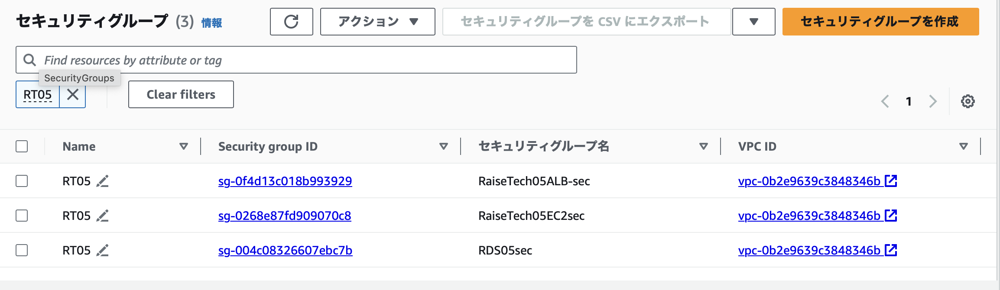

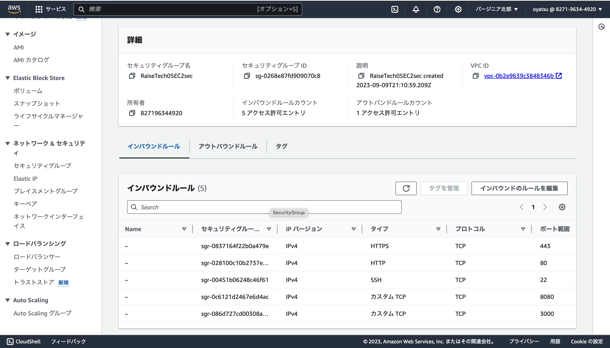

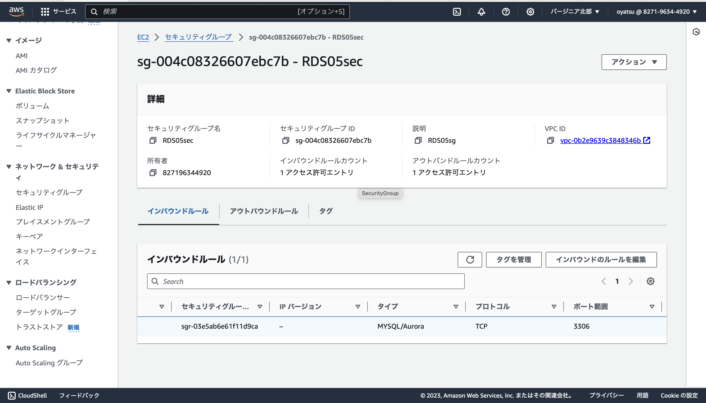

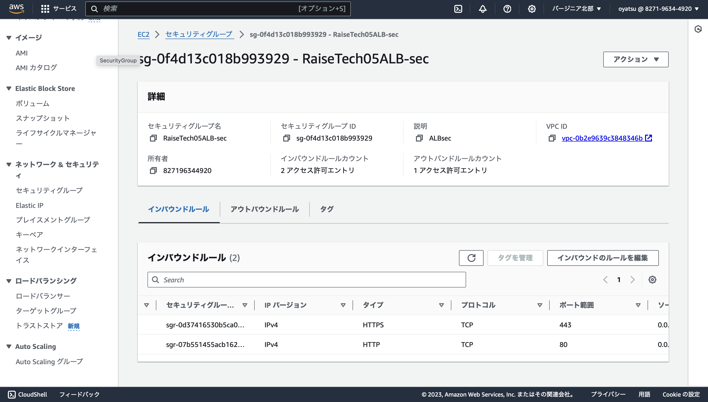

- ※アウトバウンドは全て許可しています。

