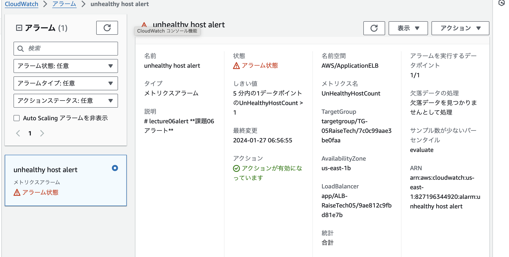
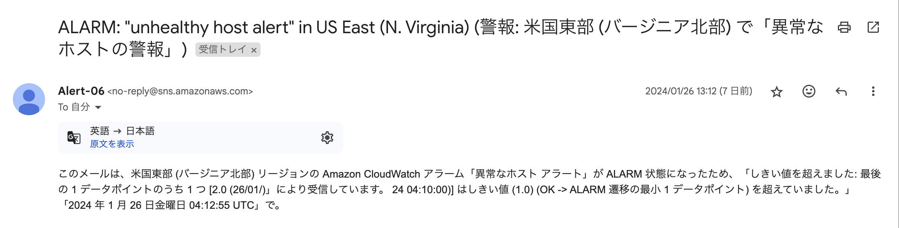
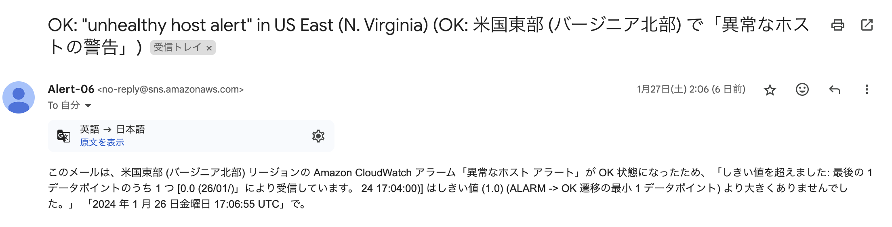
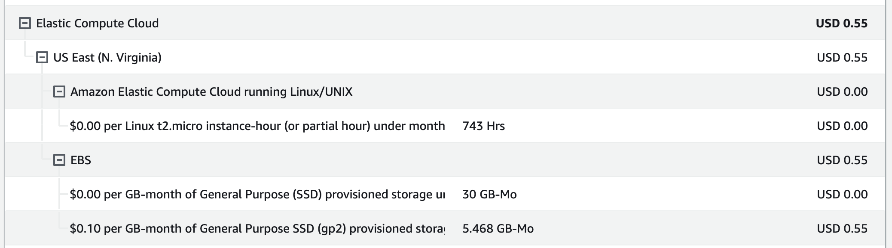

# 第6回課題報告

## [あなたが最後に AWS を利用した日の記録を、どれでもよいので CloudTrail のイベントから探し出してください。]

#### イベント名：EnableMFADevice
#### 含まれている内容３つ
* AWS アクセスキー
* 参照されたリソースの情報
* JSON形式のイベントレコード

## [今日学んだ CloudWatch アラームを使って、ALB のアラームを設定して、メール通知してみてください。]

#### 作成したアラームの詳細

#### RDSを停止して使えない状態にした場合、ALARMメールが届き、開始すればOKメールが届きました。

## [AWS 利用料の見積を作成してください。]

#### １ヶ月間フル稼働した場合を想定し、見積もりました。
#### 見積もりのURL
https://calculator.aws/#/estimate?id=86bb5d946de0dbbefeee0f09f18df30350b05857

## マネジメントコンソールから、現在の利用料を確認して教えてください。

#### 先月の請求情報から、EC2 の料金を確認した結果。USD 0.55でした。

#### 無料利用枠には収まっておりませんでした。

#### 以上です。