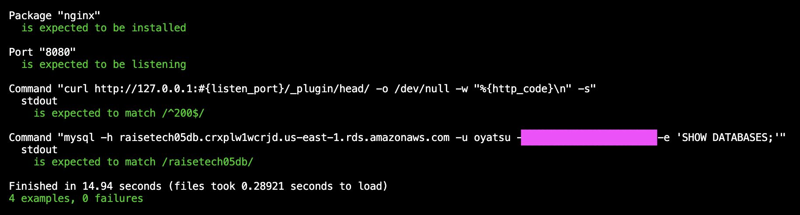

# 第11回追加課題

### 今回の課題についての説明

講義第11回では新たに課題は出題されませんでしたが、ServerSpecのテストが成功することを追加課題とされたのでゴールを以下の2点とも達成することに設定しました。

- 提供されたサンプルテストコードでテスト成功

- カスタマイズしたテストコードでテスト成功

#### 提供されたサンプルテストコードでのテスト

#### カスタマイズしたテストコードでテスト

テスト項目にRDSの接続確認を追加しました。理由は、RDSに接続できていない場合、アプリケーションが正常に動作しないため、RDS接続確認が必要と判断しました。

### おまけ：環境変数を設定するためのスクリプトを作成して自動化する

やってみたかったのでチャレンジしました。

スクリプトファイルを作成

`touch set_env.sh`

作成したファイルに実行権限を追加

`chmod +x set_env.sh`

スクリプトファイルを編集、スクリプト内容を貼り付ける。

`vi set_env.sh`

export RDS_ENDPOINT=raisetech05db.crxplw1wcrjd.
us-east-1.rds.amazonaws.com

export RDS_USERNAME=oyatsu

export RDS_PASSWORD=My-password

別ターミナルでスクリプトを実行する　

`source ./set_env.sh`

テストを実行　

`bundle exec rake spec`

変わらず成功した！嬉しい！

以上です。
