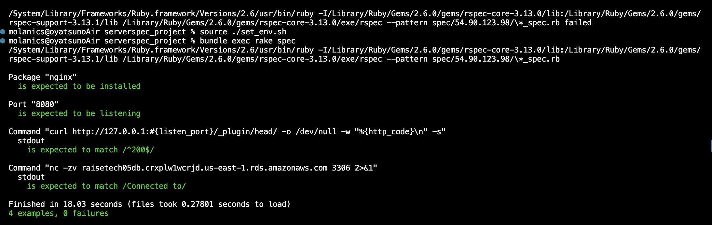

# 第11回追加課題(再提出)

### 今回の課題についての説明

講義第11回では新たに課題は出題されませんでしたが、ServerSpecのテストが成功することを追加課題とされたのでゴールを以下の2点とも達成することに設定しました。

- 提供されたサンプルテストコードでテスト成功

- カスタマイズしたテストコードでテスト成功


#### 提供されたサンプルテストコードでのテスト


#### カスタマイズしたテストコードでテスト



前回は、テスト項目にRDSの接続確認を追加しました。しかし、DBパスワードが表示されセキュリティリスクがある上に、ステータスコードの確認テストと被っているとのご指摘を受けました。そこで今回は、ネットワークレベルの疎通確認を補助的に実行することにしました。


### おまけ：環境変数を設定するためのスクリプトを作成して自動化する

```bash
#!/bin/bash

# スクリプトファイルを作成

touch set_env.sh

# 作成したファイルに実行権限を追加

chmod +x set_env.sh

# スクリプトファイルを編集

vi set_env.sh

# スクリプト内容を貼り付ける

export RDS_ENDPOINT=raisetech05db.crxplw1wcrjd.us-east-1.rds.amazonaws.com

# 別ターミナルでスクリプトを実行する　

source ./set_env.sh

# テストを実行　

bundle exec rake spec
```
やってみたかったのでチャレンジしました。

以上です。
