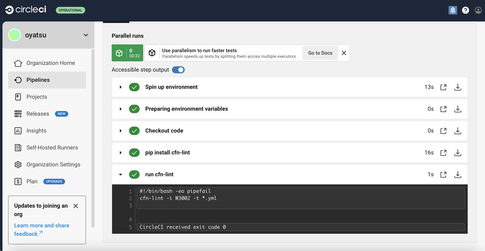

# 第１２回追加課題

## Terraformの基礎とCircleCI

### Terraformの基礎

AWSフルコース向け参考動画集、「Terraformの基礎」において、ハンズオン形式で学んだポイントをまとめました。

AWS Cloud9が新規顧客に利用できなくなったため、自分のPC（mac & vscode）で環境を構築しました。

#### 概要

* IaC(Infrastructure as Code)を支援するツール。

* HCL（HashiCorp Configration Language）で記述する。

* .tfstateというJSON形式のファイルで構築状態を管理している。このtfstateの管理方法が重要。

* CFn（CloudFormation）との違い。

  * AWS APIを直接たたく。

  * リソースごとにファイルを分けて記述し、一括でデプロイ（作成）実行できる。

  * 変数を別ファイルとして切り出せる。

#### 環境構築

* 必要なツールをインストール。

  * パッケージ管理システム(Homebrew)インストールから必要であった。
  * HomebrewでTerraformをインストール。
  * AWS CLI をインストール。

* オートコンプリートの設定。

  * Oh My Zshのインストール。
  * 補完機能をインストールする。

#### コードを書く

* AWS CLIのprofile指定。

  * `aws configure`と入力し、認証情報とリージョンを設定。
  * 認証情報ファイルのパーミッションを600に設定。
  

#### 変数を使う

* terraform.tfvarsは必ず読み込まれる変数ファ
イル、それ以外は実行時に引数（-var-file）を使って指定しないと読み込まれない。

#### tfstateファイルの扱い

* Backend機能（tfstateをリモートストレージで管理する機能）

  * AWSではS3バケットに格納するのがスタンダード。

  * Backend機能で使うS3は、対象のTerraformプロジェクトと別で作る。（同一プロジェクトで管理しているリソースだと、誤って消すとtfstateごと消失する。）

  * 通常はバージョニングを有効にする。

  * 各種ファイルを記述したらinitする。（ディレクトリが変わる、既存ディレクトリの場合でも、backendを追加した、module自体やmodule参照箇所を追加した場合もinitは必要）

  * DynamoDBを使って、排他ロック（先に操作した人が終わるまでapplyなどをブロックする）をかけるという方法もある。

* Modules機能（リソースや機能単位で分割したtfファイルのこと）

  * 各リソースがモジュールとして分離されているので、疎結合を保ったまま構築ができる。

  * 構築する環境ごとにディレクトリを作成する。（dev,stage,prodなど）

  * modulesを集めたコミュニティリポジトリがあります。■ https://github.com/terraform-aws-modules

* Workspaces機能 (Gitブランチのように環境を分けることが可能)、ただしワークスペースだけで複数環境の切り替え課題が全て解決はしないと公式でも触れている。

  * Workspacesは、modulesの章でやったような各環境ディレクトリ単位でのinitは不要。ワークスペース単位でtfstateが作成される。

  * 変数へ格納する値を.tfvarsファイルへ切り出した時は、apply時に明示的にファイル指定が必要。
  
  `terraform apply -var-file="example.tfvars"`

* 環境の削除

  * ワークスペース単位でdestroyする。

  * 削除の流れ

    1. リソースを消す。
    1. 削除対象ではないワークスペースへ移動。
    1. ワークスペースを消す。

* S3バケットの削除

  * `aws s3 rb s3://{backend機能で作成したバケット名} --force` (波括弧はいらない)

  * --forceをつけることでファイルごと削除できる。

### CircleCI

ハンズオンを完了させた後、自身の課題のリポジトリでプロジェクトの設定を行い、config.ymlを提供されたものに書き替える。と言う内容です。

ビルドに失敗し、CloudFormationテンプレートを修正もしました。

#### ハンズオン

* スタートガイドからCircleCIアプリへ飛び、サインアップ、アカウント作成。

* チュートリアルを見ながらハンズオン用のリポジトリを作成し、Hello Worldサンプルを選択、commit and Run で簡単に出来た。

#### 課題のリポジトリでプロジェクトの設定

* lecture12ブランチでプロジェクト作成、config.ymlを提供されたものに書き替えたらビルド失敗。

* リポジトリがcloudformationと言うディレクトリが存在しない構造であるために、スラッシュまで除き、*.yml とだけ記述しconfig.ymlを書き換え。

* 実行するが、CloudFormationテンプレートを検証してはいるものの警告が出てビルド失敗。

  * W3010: 特定のアベイラビリティゾーンをハードコーディングしないようにする警告。
  * W2501: パスワードをハードコーディングしないようにする警告。（DBパスワード）

* Discordで質問した結果、ベストプラクティスに則った方法にチャレンジすることにした。

* Parameter Storeで値を暗号化して保存

* CloudFormationテンプレート修正、push...成功

### 感想

文字数多くなってしまいましたが、大変学びの多いというか苦労した課題でした。（これでも削りました）

Terraformハンズオンはcloud9を使用したら簡単でした。しかし後日、新規利用停止が発表され、学習記録として残すのならば良いと思う方法でやろうと考えました。やってみて、環境が初めから整っているcloud9のありがたみを感じました！

CircleCIを触ってみて、始めは何で動作してるのかも分かりませんでしたが、触っているうちに少しずつ理解できました。そしてまさかここで第10回のCloudFormationテンプレートを修正することになるとは思いもせず、驚きでした。

以上です。
